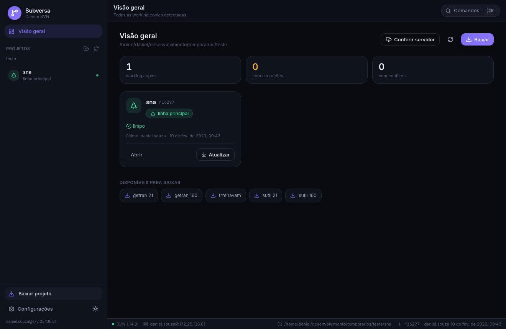
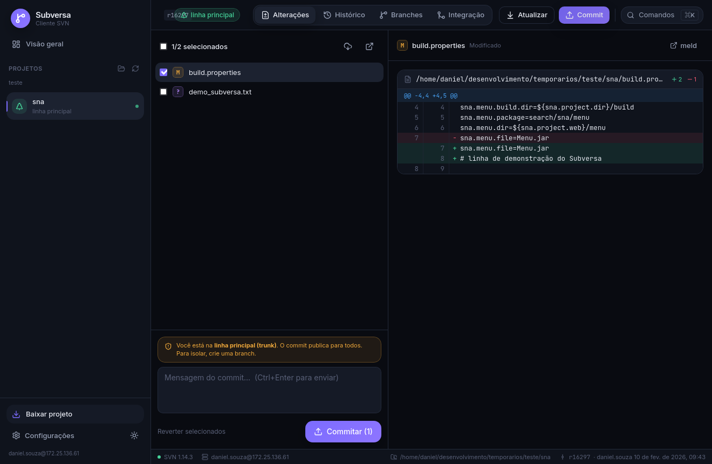
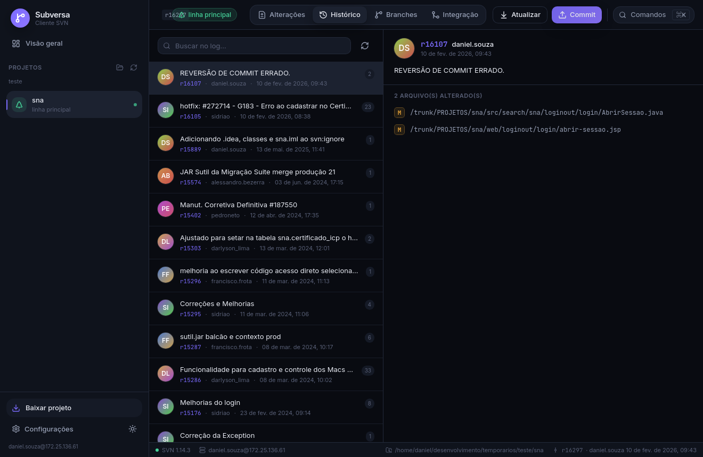
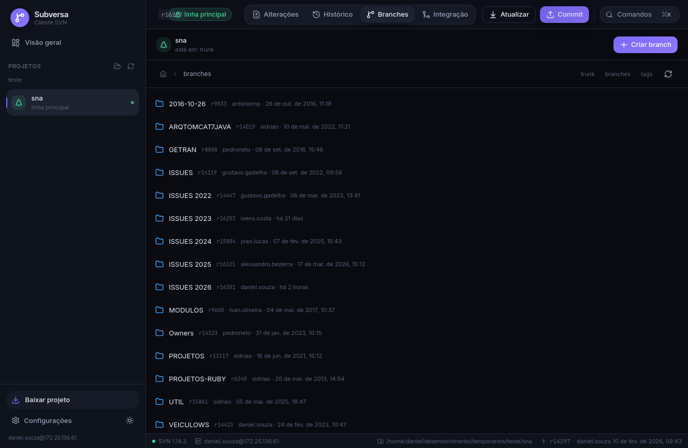
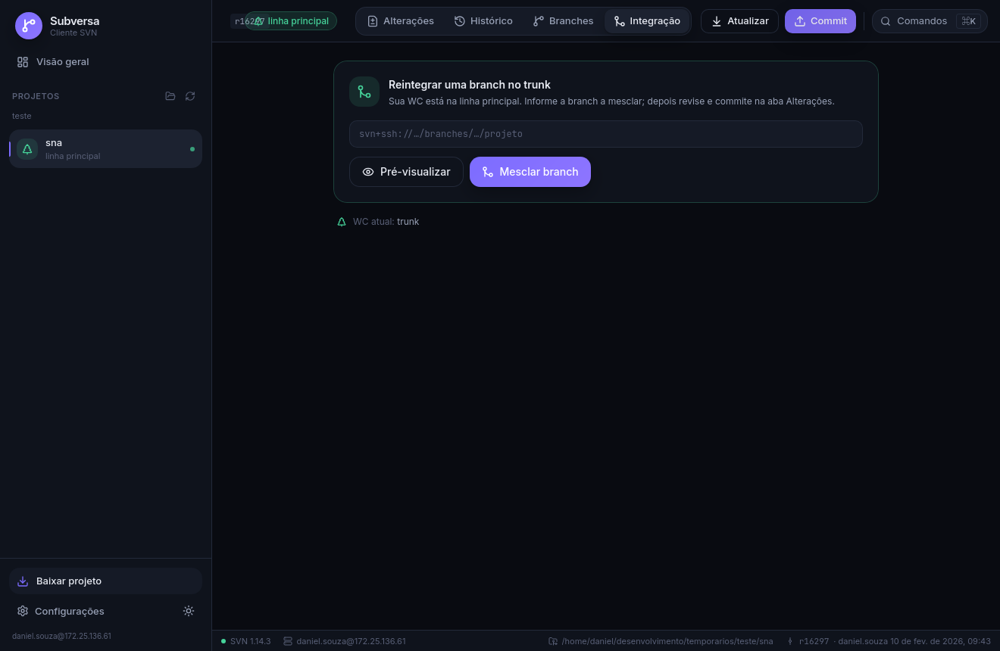

<div align="center">

# Subversa

### Cliente SVN de desktop moderno — no espírito do TortoiseSVN, com um design totalmente repaginado

Feito sob medida para o fluxo de trabalho em **Subversion puro** (sem Git no meio),
com os projetos e o servidor da sua equipe já pré-configurados.



</div>

---

## O que é

**Subversa** é um aplicativo de desktop **(Linux)** para gerenciar todo o
ciclo de trabalho em SVN com a praticidade de uma ferramenta gráfica — detectar
working copies, ver alterações, commitar, criar/trocar branches, sincronizar com a
linha principal, publicar (reintegrar), navegar pelo repositório, ler o histórico e
resolver conflitos — sem decorar comandos.

Ele foi construído a partir do seu `GUIA_SVN.md` e do `fluxo_svn.sh`: a mesma
sequência de passos, as mesmas convenções de branch (`ISSUES <ano>/<NN - MÊS>/…`),
o mesmo esquema de autenticação (`svn+ssh` com `sshpass` + ControlMaster) e os
mesmos projetos prontos (sna, getran, getran160, trrenavam, sutil, sutil160).

> **Por que não Git?** No seu ambiente o versionamento é SVN. O Subversa abraça o
> modelo do SVN de verdade: **não há `push`** — `svn commit` já vai ao servidor; a
> branch é uma cópia de diretório; trocar de branch é `svn switch`.

---

## Destaques

- 🗂️ **Detecção automática** de working copies na sua pasta de trabalho, com
  indicador de *trunk* (verde) × *branch* (roxo) e contagem de alterações.
- ✅ **Commit estilo TortoiseSVN**: lista com checkboxes, diff com **realce palavra a
  palavra**, adição automática de arquivos novos, e **aviso forte ao commitar direto
  no trunk**.
- 🌿 **Branches**: navegador do repositório, criação seguindo a convenção do repo
  (com *switch* opcional), troca de linha e exclusão protegida.
- 🔀 **Integração guiada**: *sync* (trunk → branch) e *publicar/reintegrar*
  (branch → trunk) com pré-visualização (*dry-run*).
- 🕓 **Histórico** com busca, autoria por avatar, datas relativas e arquivos
  alterados por revisão.
- ⚔️ **Resolução de conflitos** com um clique (manter minha versão / a do servidor /
  marcar como resolvido) ou abrir no `meld`.
- ⌘ **Paleta de comandos** (`Ctrl/⌘ + K`) para qualquer ação.
- 🎨 **Tema escuro e claro**, design premium, animações suaves, 100% offline (fontes
  embutidas).
- 🔐 **Autenticação `svn+ssh`** idêntica ao seu script: usa `$SSHPASS` via `sshpass`
  e mantém uma conexão SSH mestre (ControlMaster) para não repedir senha.

---

## Telas

| Alterações & commit | Histórico |
|---|---|
|  |  |

| Navegador de branches | Integração (sync / reintegrar) |
|---|---|
|  |  |

> As capturas de Branches e Histórico acima são **dados reais** do servidor de
> produção, lidos pelo app durante os testes.

---

## Mapa do fluxo (Git → SVN → Subversa)

| No Git você faz…              | No SVN é…                              | No Subversa |
|-------------------------------|----------------------------------------|-------------|
| `git clone`                   | `svn checkout`                         | **Baixar projeto** (lista de presets ou URL) |
| `git pull`                    | `svn update`                           | Botão **Atualizar** / Visão geral |
| criar branch                  | `svn copy` + `svn switch`              | **Criar branch** (convenção `ISSUES …` automática) |
| `add` + `commit` + `push`     | `svn commit`                           | Aba **Alterações** (um passo só) |
| receber a main na branch      | `svn merge <trunk>` + commit           | Integração → **Receber e commitar** |
| merge da branch na main       | `switch` + `update` + `merge` + commit | Integração → **Publicar branch no trunk** |
| deletar branch                | `svn delete <url>`                     | Branches → **apagar** (com confirmação) |

---

## Stack tecnológica

Escolhida por ser o que há de mais moderno e recomendado para apps desktop em 2026:

- **[Tauri v2](https://tauri.app)** (Rust) — backend nativo, binário pequeno e seguro,
  ideal para orquestrar o `svn` e o `svn+ssh`.
- **React 19 + TypeScript + Vite 7** — frontend.
- **Tailwind CSS v4** — design system (tema escuro/claro em runtime).
- **Zustand** (estado), **Framer Motion** (animações), **Lucide** (ícones),
  **jsdiff** (realce de diff), **Inter / JetBrains Mono** (fontes embutidas).
- O parsing usa a saída **`--xml`** do Subversion (estável e independente de idioma);
  os erros são mapeados por **código** (`E155011`, `E160013`, …) para dicas amigáveis.

Veja **[docs/ARQUITETURA.md](docs/ARQUITETURA.md)** para o detalhamento.

---

## Pré-requisitos

- **Subversion** (`svn`) 1.8+ no PATH — testado com 1.14.
- **sshpass** (para autenticar `svn+ssh` por senha): `sudo apt install sshpass`.
- A senha em `$SSHPASS` (já vem do `/etc/environment` no seu setup), **ou** uma chave
  SSH/`ssh-agent` configurada no servidor.
- Para **desenvolver/compilar**: Node 18+, Rust (stable) e as libs do Tauri
  (`webkit2gtk-4.1`, `libsoup-3.0`).

---

## Rodando em desenvolvimento

```bash
cd subversa
npm install
npm run tauri dev
```

> Em alguns ambientes X11 pode ser necessário desativar a aceleração do WebKit:
> `WEBKIT_DISABLE_DMABUF_RENDERER=1 WEBKIT_DISABLE_COMPOSITING_MODE=1 npm run tauri dev`

## Compilando para produção

```bash
npm run tauri build                    # binário + pacotes do sistema
npm run tauri build -- --bundles deb   # apenas o .deb (Ubuntu/Debian)
```

Os artefatos saem em `src-tauri/target/release/` (binário `subversa`) e
`src-tauri/target/release/bundle/` (`.deb`, `.AppImage`, etc.).

---

## Configuração

Na primeira execução é criado `~/.config/subversa/config.json` com os seus projetos
e servidor. Tudo é editável dentro do app (aba **Configurações**):

- **Pasta de trabalho** — onde ficam as working copies (detecção automática).
- **Host SSH** e **modo de autenticação** (`auto` / `chave` / `senha`).
- **Meus projetos** — atalhos de checkout e a URL da linha principal de cada um
  (usada para *sync*/*reintegrate* e para reconhecer trunk × branch).
- **Preferências** — confirmar operações no servidor, modo verboso, ferramenta de
  diff externa (`meld`), tema.

### Autenticação `svn+ssh`

O Subversa reproduz exatamente a estratégia do `fluxo_svn.sh`: define a variável
`SVN_SSH` para usar `sshpass -e ssh …` (lendo `$SSHPASS`) quando há senha disponível,
ou `ssh` puro quando você usa chave; e mantém um **ControlMaster** persistente
(`~/.cache/subversa/ssh/`) para não repedir a senha a cada comando.

---

## Atalhos

| Atalho | Ação |
|--------|------|
| `Ctrl/⌘ + K` | Abrir a paleta de comandos |
| `Ctrl/⌘ + Enter` | Commitar (no campo de mensagem) |
| `Esc` | Fechar diálogos / paleta |

---

## Segurança & cuidados

- Toda operação que **escreve no servidor** (commit, merge, switch, copy, delete)
  pede confirmação (pode ser desligado nas preferências).
- Commitar **direto no trunk** dispara um aviso destacado.
- Excluir branch no servidor exige **digitar o nome** para confirmar.

---

## Solução de problemas

| Sintoma | O que fazer |
|--------|-------------|
| “Falha de conexão / rede fechou” | Verifique VPN/rede e o acesso SSH ao servidor. |
| Pede senha o tempo todo | Garanta `$SSHPASS` no ambiente ou uma chave SSH; instale `sshpass`. |
| `E155004` (locked) | Use **Limpar (cleanup)** na paleta de comandos. |
| `E155011 / E160024` (out of date) | **Atualizar** antes de commitar. |
| Conflito (`C`) | Resolva pela aba **Alterações** → botão de conflito. |
| Janela em branco no Linux | Rode com `WEBKIT_DISABLE_DMABUF_RENDERER=1`. |

---

## Licença

Projeto interno, feito sob medida. Use à vontade.

<div align="center"><sub>Subversa · cliente SVN moderno · construído com Tauri + React</sub></div>
